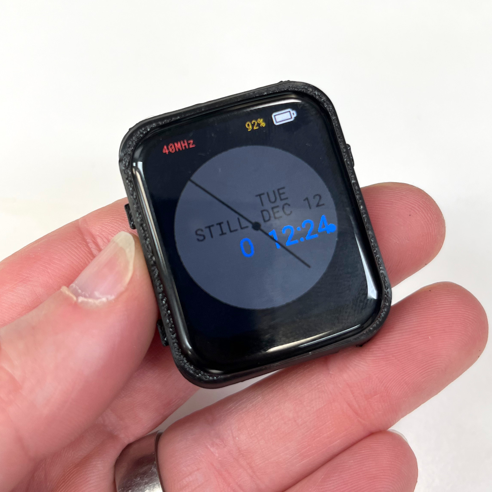

# Introducing TinyWATCH S3
TinyWATCH S3 is an open source, hackable, smart watch designed by Unexpected Maker.

In this repository you'll (eventually) find all of the hardware design files and firmware for the TinyWATCH S3 project.

You can buy the TinyWATCH hardware from:
https://unexpectedmaker.com/tinywatchs3

I'll be adding more files over time....

# License - What can I do with these files?

All hardware file are released under the CERN Open Hardware license version 1.2, which means any use of the files requires the derivative works to also be released in full as open source files.

All firmware and other non electronics design files are released under the GPL 3.0 license, which means any use of the files or code requires the derivative works to also be released in full as open source files, as GPL 3.0.

Please read the licenses to understand your obligations if you decide to use any of the files in this repository. Thanks :)   

# Support Unexpected Maker

I love designing, making, and releasing projects and products that empower others to learn and build amazing things! I do it because I believe it’s important to share knowledge and give back to the community as many have done before me. It helps us all learn and grow.

Please consider supporting me by buying some of my products from:

https://unexpectedmaker.com/shop

Or by buying one of my products on tindie:

https://www.tindie.com/stores/seonr/

Or by becoming a Patron:

https://www.patreon.com/unexpectedmaker

## Unexpected Maker
http://youtube.com/c/unexpectedmaker

http://twitter.com/unexpectedmaker

https://discord.gg/xAHpApP

https://www.facebook.com/unexpectedmaker/

